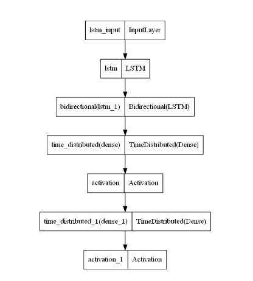
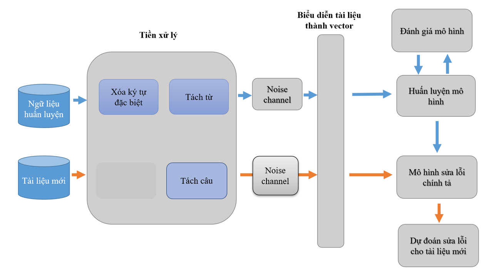
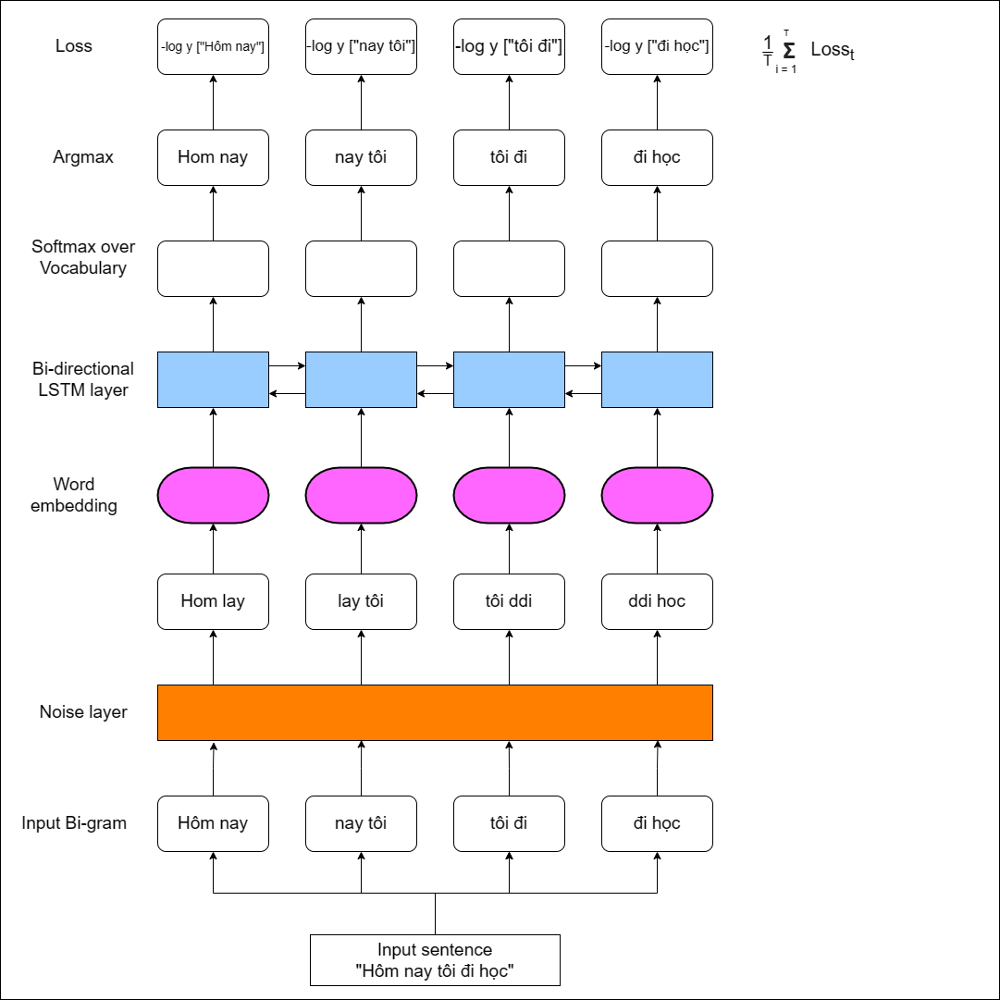
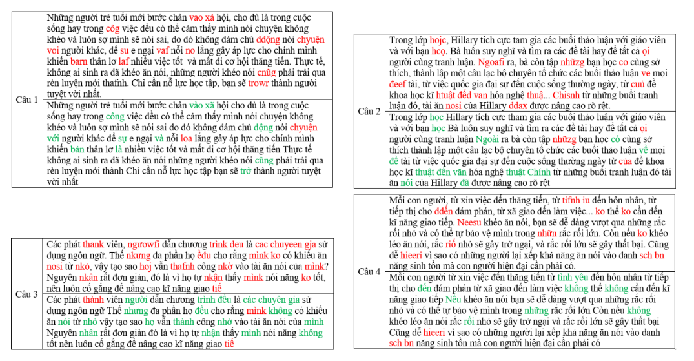
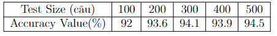
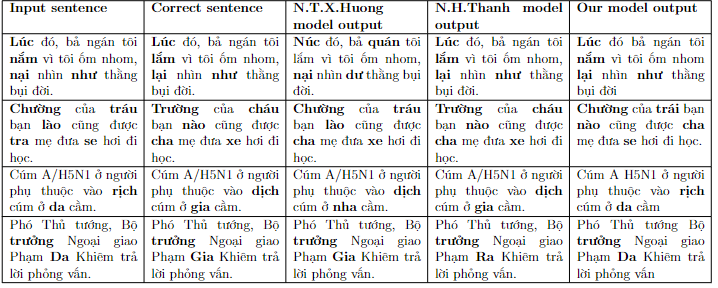

# Bi-directional LSTM Vietnamese Spelling AutoCorrection

  

## Abstract
 By using Bi-directional LSTM, this project creates a neural network NLP model that can corrects Vietnamese spelling error with the accuracy up to 94.5%

 This project was carried out by 3 students from Hue University of Sciences: Nguyen Ngoc Quang Huy, Ly Nhat Phuong, and Nguyen Hoai Nam.
 
 This project is mainly referenced at: https://github.com/LeTuanCS150901/LSTM-Based-Vietnamese-Spell-Correction.
 Thanks a lot!

## Data Acquisition
The original dataset is taken from VNTQ dataset(Duy Hoang et al 2007) that is a collection of articles from Vietnamese news outlets. Dataset consists of 10 subjects : Politics, Life, Sciences, Finances, Law and Order, Health, International News, Sports, Culture, IT.

We pruned the dataset to reduce training and testing time.

## Project Architecture

  

## Model WorkFlow

  

## Results

Example:

  

Accuracy:

  

Compare to other model:

  

## References
* Nguyen Thi Xuan Huong; Dang; The Tung Nguyen; Anh Cuong Le;. Using large n-gram for vietnamese spell checking. 2015
* Nguyen Hua Phung; Thuan D. Ngo; Dung A. Phan; Thu P.T Dinh; Thang Q. Huynh.Vietnamese spelling detection and correction using bi-gram, minimum edit distance,soundex algorithms with some additional heuristics. 2008
* Nguyen Q.D.; Le D.A.; Zelinka. Ocr error correction for unconstrained vietnamese handwritten text. 2019
* Nguyen Ha Thanh; Dang Tran Binh; Nguyen Le Minh. Deep learning approach for vietnamese consonant misspell correction. 2019
* https://github.com/LeTuanCS150901/LSTM-Based-Vietnamese-Spell-Correction
* https://github.com/duyvuleo/VNTC